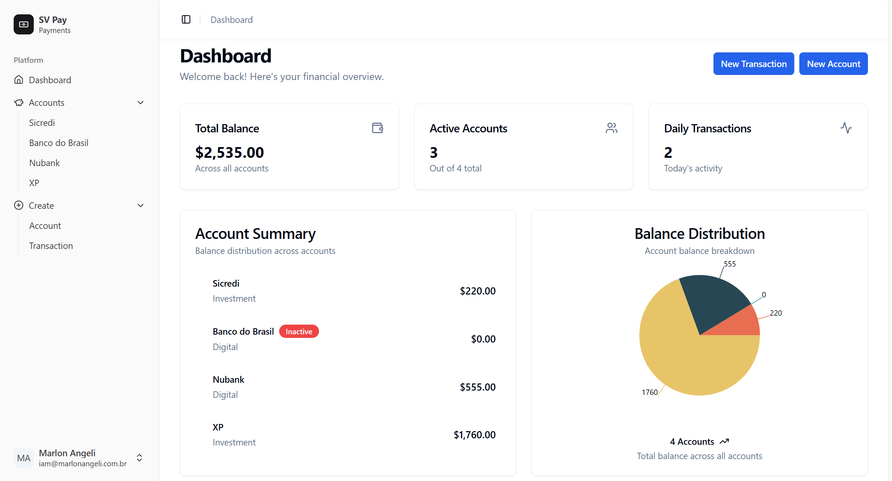
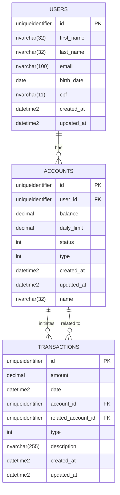

# SV Pay

<p align="center">
    
</p>

A modern payment management system built with **.NET 8**, **SQL Server**, and **Next.js 15**. Designed to streamline financial operations with robust transaction management and real-time analytics.

## 🚀 Features

### Core Banking Operations
- **Account Management**
  - Create new accounts with customizable limits
  - Activate/deactivate accounts
  - Update daily limits
  - View account balance and status
- **Transaction System**
  - Secure deposits, withdrawals and transfers
  - Inter-account transfers
  - Comprehensive transaction history
- **Financial Insights**
  - Real-time balance tracking
  - Daily transaction metrics
  - Account status monitoring

### Advanced Features
- 📅 Period-based transaction statements
- 📊 Interactive balance distribution charts
- 📈 Real-time account updates
- ✅ Comprehensive test coverage (unit & integration)
- 📚 Full API documentation with Swagger

## 🛠️ Technologies Used

**Backend**
- .NET 8
- Entity Framework Core
- SQL Server
- MediatR (CQRS Pattern)
- FluentValidation
- xUnit/NUnit (Testing)

**Frontend**
- Next.js 15 (App Router)
- React 19
- TypeScript
- Tailwind CSS + Shadcn UI
- React Query (Data Fetching)
- Chart.js (Data Visualization)
- Kubb (Toolkit for API)

**Infrastructure**
- Docker Containers
- SQL Server Health Checks
- Automated Migrations
- Environment-based Configuration

## ⚙️ Installation

### Prerequisites
- Docker & Docker Compose
- Node.js 20+
- .NET 8 SDK

```bash
# Clone repository
git clone https://github.com/marlonangeli/sv-pay.git

# Start containers
docker compose up -d
```

**Environment Setup**

1. Create a `.env` file in the **root** directory with `.env.example` as a template.
2. Create a `.env` file in the `web/` directory with `.env.example` as a template.


## 📚 API Documentation

Access Swagger UI at `http://localhost:5000/swagger`

**Key Endpoints**
```
GET    /api/v1/accounts/{id}         - Get account details
POST   /api/v1/accounts              - Create new account
POST   /api/v1/transactions/deposit  - Create deposit
POST   /api/v1/transactions/withdraw - Create withdrawal
GET    /api/v1/accounts/{id}/extract - Get account statement
```

## 🗂️ Project Structure

```
sv-pay/
├── api/                 # .NET Core API
│   ├── Api/             
│   ├── Application/     
│   ├── Data/            
│   ├── Domain/          
│   ├── Shared/          
│   ├── UnitTests/          
│   └── IntegrationTests/          
├── web/                 # Next.js Frontend
│   ├── app/             
│   ├── components/      
│   ├── hooks/           
│   ├── http/            
│   ├── lib/             
│   └── .env
├── .env
└── compose.yml          
```

## 🧪 Testing

**Backend Tests**
```bash
dotnet test tests/SV.Pay.UnitTests
dotnet test tests/SV.Pay.IntegrationTests
```

**Test Coverage**
- Unit Tests: CPF validation, Money calculations
- Integration Tests: All API endpoints, DB interactions

## 📈 Database Schema



## 🏆 Key Differentiators

✅ Clean Architecture  
✅ CQRS Pattern  
✅ End-to-end Type Safety  
✅ Comprehensive Error Handling  
✅ Responsive UI Components    
✅ Transactional Integrity Checks  
